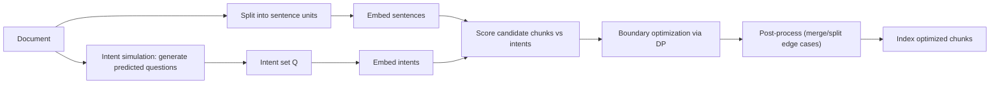
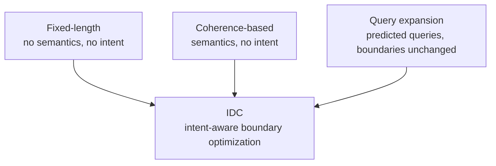

# Intent-Driven Dynamic Chunking (IDC)
*A narrative, meeting-friendly document for patent drafting discussions*

> **Audience:** Patent counsel / drafting attorneys (technical but not necessarily ML specialists)  
> **Use:** If you don’t want to use slides, you can walk through this document section-by-section.  
> **Core claim idea (plain language):** *Predict likely user questions for a document, then choose chunk boundaries that maximize how well each chunk answers one of those questions.*

---

## Table of contents

1. Executive summary  
2. Why chunking matters (retrieval + RAG)  
3. Baseline methods (what exists today)  
4. The gap (what’s missing)  
5. IDC overview (pipeline)  
6. IDC method in detail (with math)  
7. How parameters affect boundaries  
8. Worked example (baselines vs IDC)  
9. Evaluation highlights (retrieval, efficiency, cost)  
10. Novelty and claimable aspects  
11. Practical implementation notes  
12. FAQ (common questions and suggested answers)

---

## 1. Executive summary

**Intent-Driven Dynamic Chunking (IDC)** is a document segmentation method for retrieval systems (semantic search, QA, and RAG) that **splits a document into chunks aligned to predicted user intents** (questions users are likely to ask).

Instead of splitting by:
- fixed size (every *N* tokens/sentences), or
- internal topic structure only,

IDC:
1. **predicts plausible user questions** for the document, and then  
2. **optimizes chunk boundaries** so that each chunk is an **answer-sized**, **high-relevance** unit for one of those predicted intents.

Practical outcomes:
- Higher “top-1” retrieval success (first retrieved chunk contains the answer more often).
- Often **fewer chunks** than baseline chunking strategies, reducing index size and duplicated noise.

---

## 2. Why chunking matters (retrieval + RAG)

Most modern retrieval pipelines operate over **chunks**, not whole documents:

1. Split documents → chunks  
2. Index chunks (dense vectors, BM25, or hybrid)  
3. Query time: retrieve top-k chunks  
4. (Optional) feed retrieved chunks into an LLM for RAG answers

Chunk boundaries determine:

- **Answer containment:** whether a complete answer exists inside a single chunk.
- **Noise vs relevance:** whether the returned chunk is mostly useful or mostly distracting.
- **Index size & latency:** more chunks → bigger index → more retrieval work.
- **RAG reliability:** irrelevant or incomplete context can cause hallucinations, verbose answers, or omissions.

**Key observation:** Many systems treat chunking as a “simple pre-processing step,” but in practice it is a **core algorithmic choice** that strongly affects retrieval quality.

---

## 3. Baseline methods (what exists today)

This section provides clear contrast points for the meeting.

### 3.1 Baseline A — Fixed-length, non-overlapping chunking

**Definition:** Split the text into uniform chunks of length *N* (tokens, characters, or sentences), with **no overlap**.

**Typical examples**
- 200–600 tokens per chunk (common in RAG tooling)
- 5–10 sentences per chunk (common in evaluation setups)

**Pros**
- Simple, deterministic, fast
- Predictable chunk sizes for downstream model limits

**Cons / failure modes**
- **Arbitrary boundaries:** often cut through answers or procedures.
- **Fragmentation:** answer spans two chunks → neither chunk alone is sufficient.
- **Noise dilution:** larger N mixes subtopics; relevant signal is diluted by unrelated text.
- **Brittle tuning:** the “best” N differs by document type and even by section within a document.

**Real-world symptom (technical docs):**
An engineer asks “How do I use API X?” and retrieves a chunk that mentions API X but includes many unrelated details—or the steps are split across two chunks.

---

### 3.2 Baseline B — Sliding window (overlapping fixed-length)

**Definition:** Fixed-length chunks with overlap (stride < chunk length).  
Example: 6-sentence chunks with stride 3 (50% overlap).

**Pros**
- Reduces fragmentation compared to non-overlapping fixed chunks
- Improves recall because at least one overlapping chunk may fully contain the answer

**Cons / failure modes**
- **Index bloat:** many more chunks → more storage and compute.
- **Redundant noise:** near-duplicate chunks reduce ranking diversity.
- Still does not “understand” what the user is asking; overlap only mitigates the symptom.

---

### 3.3 Baseline C — Paragraph / structure-based segmentation

**Definition:** Use natural document structure boundaries: paragraphs, headings, HTML sections, list blocks.

**Pros**
- Often readable and human-aligned
- Strong when documents are consistently structured

**Cons / failure modes**
- **Inconsistent granularity:** some paragraphs are huge; others tiny.
- **Formatting variability:** enterprise docs may contain long “wall of text” blocks.
- **Answer spans multiple paragraphs:** procedures and definitions frequently cross boundaries.

---

### 3.4 Baseline D — Coherence-based / topic shift segmentation

**Definition:** Segment where the topic changes using signals like lexical cohesion or semantic similarity.  
Examples include TextTiling-like and C99-like approaches, plus modern transformer-based segmentation models.

**Pros**
- Produces topically coherent segments
- Often more robust than fixed-length when topic shifts are clear

**Cons / failure modes**
- Still **query-agnostic**: optimized for *internal coherence*, not the user’s question.
- A segment can be coherent but **too broad** for a specific query (“needle in a coherent haystack”).
- A topic shift detector can cut near the middle of an answer if a subtopic transition occurs mid-explanation.

---

### 3.5 Baseline E — Query/document expansion (doc2query-style)

**Definition:** Predict queries a document or passage can answer and append them to the indexed text to improve matching.

**Pros**
- Helps with vocabulary mismatch (query uses terms not present in the text)
- Often boosts recall

**Key limitation**
- Expansion **does not change boundaries**.
- If segmentation splits an answer across chunks, expansion cannot rejoin it into one retrievable unit.

**Why this matters for IDC:**  
IDC keeps the useful concept “predicted questions” but uses them to drive **where to split**, not only what to append.

---

## 4. The gap (what’s missing)

Across these baselines:

- Fixed-length and sliding windows are easy but arbitrary and intent-blind.
- Paragraph and coherence-based segmenters respect structure, but remain query-agnostic.
- Expansion predicts questions but **does not restructure** the document.

**Missing capability:**

> A general method that uses predicted user intents to directly determine chunk boundaries, producing “answer-sized” segments aligned to information needs.

IDC is designed to fill exactly this gap.

---

## 5. IDC overview (pipeline)

**One sentence:**
> Predict likely user questions → segment the document so each chunk best answers one predicted question.

### Mermaid — IDC pipeline (GitHub-safe)

**Important framing:**  
IDC is an **offline indexing-time** method. Query-time retrieval is unchanged—only the chunk boundaries differ.

---

## 6. IDC method in detail (with math)

### 6.1 Stage 1 — Intent Simulation (predicted questions)

We generate a set of intents/questions for document \(D\):

$$
Q = \{q_1, q_2, \ldots, q_M\}
$$

**Practical intent-generation details (useful for claims and implementation notes):**
- Generate *more* questions for longer/more complex documents.
- For very long documents, generate intents **section-wise** to cover all topics.
- Use stochastic decoding (e.g., top-k sampling) to encourage diversity.
- Remove redundant questions using embedding similarity (e.g., drop near-duplicates above a threshold such as 0.85 cosine similarity).

**Why this helps:**  
The intent set acts as an explicit list of “information needs” that segmentation can optimize for.

---

### 6.2 Stage 2 — Representations (embeddings)

Split the document into sentence units:

$$
S = \{s_1, s_2, \ldots, s_N\}
$$

Let \(e(\cdot)\) be an embedding function mapping text → a vector in a shared semantic space:
- embed each sentence \(e(s_i)\)
- embed each intent \(e(q)\)

Define a candidate chunk \(C_{i..j}\) as contiguous sentences \(s_i \ldots s_j\).

A simple chunk embedding is the mean of its sentence embeddings:

$$
e(C_{i..j}) = \frac{1}{j-i+1}\sum_{t=i}^{j} e(s_t)
$$

**Notes / variants:** weighted pooling, attention pooling, hierarchical paragraph embeddings, etc. can also be used (see §10).

---

### 6.3 Stage 3 — Chunk–intent relevance scoring

For each candidate chunk \(C\), define relevance:

$$
R(C) = \max_{q\in Q} \cos\big(e(C), e(q)\big)
$$

**Intuition:**
- A chunk is “good” if it strongly matches at least one predicted intent.
- If a chunk mixes unrelated content, it won’t strongly match any single intent and the score will be lower.

**Concrete example:**  
If a predicted intent is “What does error code 123 mean?” and a chunk contains the explanation of error 123, the similarity is high.  
If the chunk also contains many unrelated errors and sections, the signal is diluted and similarity can drop.

---

### 6.4 Stage 4 — Global objective for segmentation

Let the segmentation be:

$$
\mathcal{S}=\{C_1, C_2, \ldots, C_k\}
$$

IDC maximizes:

$$
U(\mathcal{S}) = \sum_{m=1}^{k} R(C_m) - \lambda\sum_{m=1}^{k}|C_m|^2 - \beta(k-1)
$$

Where:
- \(R(C_m)\): reward for intent alignment
- \(|C_m|^2\): length penalty (discourage very long chunks)
- \(eta\): boundary penalty (discourage too many chunks)
- Typical tuning pattern: \(\lambda\) is small (e.g., 0.0005) and \(eta\) is moderate (e.g., 0.1), so we allow context when it helps but avoid over-splitting.

**Why include penalties at all?**  
Without penalties, the optimizer could create too many tiny chunks (high relevance but expensive index) or one huge chunk (high coverage but noisy). The penalties give control over the trade-off.

---

### 6.5 Boundary optimization via Dynamic Programming (DP)

Define \(f(j)\) as best achievable utility segmenting sentences \(1..j\).

Base case:

$$
f(0)=0
$$

Recurrence:

$$
f(j)=\max_{0\le i < j}\Big[f(i)+R(C_{i+1..j})-\lambda|C_{i+1..j}|^2-\beta\Big]
$$

Then backtrack from \(f(N)\) to recover boundary positions.

#### Practical runtime

To keep DP efficient, restrict candidate chunks to a maximum length \(L\) sentences (e.g., 10–15).  
Then complexity is approximately:

$$
O(N\cdot L)
$$

This is efficient for offline indexing, even for long documents.

---

### 6.6 Post-processing refinements

After DP produces boundaries:
- merge tiny chunks (too short / same intent as neighbor)
- split extremely long chunks at natural boundaries (paragraph breaks)
- optional multi-pass refinement

These refinements improve readability without changing the core invention (intent scoring + optimized boundaries).

---

## 7. How parameters affect boundaries (easy explanation)

- Increase \(\lambda\) → stronger penalty for long chunks → **more shorter** chunks
- Increase \(eta\) → stronger penalty per boundary → **fewer larger** chunks
- Increase max length \(L\) → allow longer candidate chunks (more context) but larger DP search

This is helpful for attorneys because it shows the method is **controllable and explainable**, not a black box.

---

## 8. Worked example (baselines vs IDC)

### Scenario

A 12-sentence document contains three “answer units”:
- sentences 1–4: definition of concept Y  
- sentences 5–8: how to configure X  
- sentences 9–12: troubleshooting Z  

Predicted intents:
1. “What is Y?”
2. “How do I configure X?”
3. “How do I troubleshoot Z?”

### Fixed-length (6 sentences, non-overlapping)
- Chunk A: 1–6 (Y + part of X)
- Chunk B: 7–12 (part of X + Z)

Now “How do I configure X?” is split or mixed with unrelated content.

### Sliding window (6 sentences, stride 3)
Better chance that one chunk contains the full X steps, but:
- more chunks
- more duplication
- still arbitrary boundaries

### Paragraph-based
Works only if the document is nicely structured into those three parts. If formatting varies, paragraphs won’t match question granularity.

### Coherence-based
May split at topic shift, but can still split mid-answer if the topic boundary is detected inside the procedure.

### IDC (intent-aligned)
DP tends to prefer:
- 1–4 (best match “What is Y?”)
- 5–8 (best match “Configure X?”)
- 9–12 (best match “Troubleshoot Z?”)

Each chunk is answer-sized and aligned to one intent.

---

## 9. Evaluation highlights (retrieval, efficiency, cost)

This section summarizes the key points you can cite in conversation.

### 9.1 Retrieval improvements (top-1 accuracy)

Across diverse QA-style datasets (news, Wikipedia, academic papers, technical documentation), IDC improved **Recall@1** on most datasets with gains ranging from modest to very large, and matched the best baseline on a highly structured dataset.

**Key narrative:**  
IDC improves the chance that the *first* retrieved chunk contains the answer—especially on long, heterogeneous documents.

### 9.2 Fewer chunks (index efficiency)

IDC often produces **40–60% fewer chunks** than fixed-length / overlapping baselines, which yields:
- smaller index
- faster retrieval
- less redundant noise

### 9.3 Higher answer containment

Despite fewer chunks, IDC can keep answers intact within single chunks at high rates (e.g., **~93–100% answer coverage** in tested settings), meaning answers are less likely to be split across boundaries.

### 9.4 Offline-only cost profile

- Intent generation dominates offline time/cost.
- DP is fast.
- Query-time latency is unchanged; IDC simply improves the chunk inventory the retriever searches over.

---

## 10. Novelty and claimable aspects

### 10.1 The core novelty (high level)

IDC’s novelty is not only “we generate questions”—that idea exists in query expansion.  
IDC’s novelty is:

1. **Using predicted intents to drive segmentation boundaries**, i.e., restructuring the document.
2. A **global optimization objective** that explicitly rewards intent alignment while controlling chunk length and chunk count.
3. A **hybrid architecture**:
   - intent generation via LLM (semantic reasoning), and
   - boundary selection via DP (deterministic, optimal, tunable).

### 10.2 Simple “prior art quadrant” diagram

---

## 11. Practical implementation notes

### 11.1 What’s required
- A method to generate predicted intents/questions per document (LLM or other generator).
- An embedding model for sentences and intents (any shared vector space approach).
- A DP (or equivalent optimizer) implementation that selects boundaries by maximizing utility.
- Optional post-processing heuristics.

### 11.2 What is stored in the index
- Chunk text
- (Optional) chunk metadata: best-matching intent label, section id, paragraph id
- (Optional) expanded queries as metadata (can combine with expansion, but not required)

### 11.3 Integration with hybrid retrieval
IDC works with:
- dense-only retrieval
- sparse-only retrieval (BM25)
- hybrid retrieval (dense + BM25 weighted blend)

---

## 12. FAQ (common questions & suggested answers)

### Q1. What is IDC in plain language?
**A:** It’s a way to split documents by anticipating the questions users will ask, so each chunk is shaped like an answer to a likely question.

### Q2. How is this different from fixed-length or coherence-based segmentation?
**A:** Those decide boundaries from length or topic structure. IDC uses predicted user intents as the optimization target for where to cut.

### Q3. How is this different from doc2query / query expansion?
**A:** Expansion adds predicted queries to improve matching, but doesn’t move boundaries. IDC uses predicted queries to choose boundaries, so chunks themselves are answer-sized.

### Q4. Why dynamic programming?
**A:** DP gives a globally optimal segmentation under an explicit objective function. It is deterministic, tunable, efficient, and avoids risks of an LLM directly editing the document.

### Q5. What knobs exist to tune behavior?
**A:** \(\lambda\) controls penalty for long chunks, \(eta\) controls penalty per boundary (number of chunks), and \(L\) limits maximum candidate chunk length for efficiency.

### Q6. Do you need a specific LLM or embedding model?
**A:** No. Any intent generator and any embedding model supporting similarity scoring can be used. The invention is the intent-aligned segmentation + optimization.

### Q7. Where does IDC help most?
**A:** Long, heterogeneous documents where baselines fragment answers or return overly broad chunks with noise.

### Q8. What if predicted intents miss a real user question?
**A:** Coverage matters; mitigations include generating intents per section, generating more intents for long docs, or incorporating query logs.

### Q9. Why is “fewer chunks” a benefit?
**A:** It reduces index size and redundancy, and can reduce retrieval noise while still improving top-1 retrieval.

### Q10. Is IDC only for QA?
**A:** No. Any retrieval pipeline benefits (search, navigation, RAG summarization, support assistants) where returning the right context matters.

---

*End of document.*
