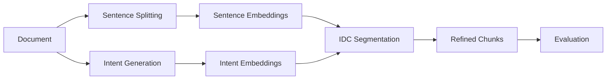

# IDC: Intent-Driven Dynamic Chunking

[](https://opensource.org/licenses/MIT)
[](https://www.python.org/downloads/)

**IDC** is a novel document segmentation method that chunks documents based on predicted user queries (intents) rather than arbitrary fixed sizes. This approach aligns document structure with actual information needs, significantly improving retrieval performance.

> **Paper Replication Repository**: This repository contains all code, data, and documentation needed to replicate the results presented in the IDC thesis.

## Key Innovation

Traditional chunking methods segment documents using:
- **Fixed-length**: Arbitrary splits every N sentences
- **Sliding window**: Overlapping fixed windows
- **Coherence-based**: Topic boundary detection

**IDC is different**: It predicts what questions users will ask about a document, then segments so each chunk can answer one of those predicted questions.



## Results Summary

IDC outperforms all baselines across 4 diverse datasets:

| Dataset | Domain | IDC R@1 | Best Baseline | Improvement |
|---------|--------|---------|---------------|-------------|
| **SQuAD** | Wikipedia | **0.689** | Fixed (0.655) | +5.2% |
| **NewsQA** | News | **0.933** | Coherence (0.867) | +7.6% |
| **arXiv** | Academic | **0.533** | Coherence (0.467) | +14.1% |
| **Fiori** | Technical | **0.400** | Fixed (0.200) | +100% |

## Installation

### Prerequisites
- Python 3.10 or higher
- Google Gemini API key ([Get one here](https://aistudio.google.com/app/apikey))

### Setup

```bash
# Clone the repository
git clone https://github.com/unseen1980/IDC.git
cd IDC

# Create virtual environment (recommended)
python -m venv venv
source venv/bin/activate  # On Windows: venv\Scripts\activate

# Install dependencies
pip install -r requirements.txt

# Configure API key
cp .env.example .env
# Edit .env and add your GEMINI_API_KEY
```

### Dependencies

```
google-generativeai>=0.8.0   # Gemini API for intents & embeddings
nltk>=3.9                    # Sentence tokenization
numpy>=1.26.4                # Array operations
faiss-cpu==1.8.0.post1       # Vector similarity search
PySide6>=6.7                 # Qt desktop UI (optional)
tiktoken>=0.7.0              # Token counting
tqdm>=4.66.0                 # Progress bars
python-dotenv>=1.0.1         # Environment management
```

## Quick Start

### Option 1: End-to-End Pipeline (Recommended)

Run the complete pipeline on a sample document:

```bash
# Process the Normans Wikipedia article from SQuAD
DOC_NAME=Normans ./scripts/run_idc_pipeline.sh
```

### Option 2: Interactive CLI

```bash
python src/cli.py menu
```

### Option 3: Step-by-Step

```bash
# 1. Preprocess document to sentences
python src/preprocess.py \
  --input data/squad_normans \
  --glob "*.txt" \
  --out out/Normans/sentences.jsonl

# 2. Generate intents (predicted questions)
python src/intents.py \
  --input data/squad_normans \
  --out out/Normans/predicted_intents.jsonl \
  --model gemini-2.5-flash

# 3. Embed sentences
python src/embed.py \
  --embedder gemini-embedding-001 \
  --dim 1536 sentences \
  --sentences out/Normans/sentences.jsonl \
  --out-npy out/Normans/sentence_embs.npy \
  --out-meta out/Normans/sentences.meta.jsonl

# 4. Embed intents
python src/embed.py \
  --embedder gemini-embedding-001 \
  --dim 1536 intents \
  --intents out/Normans/predicted_intents.jsonl \
  --out-npy out/Normans/intent_embs.npy \
  --out-flat out/Normans/intents.flat.jsonl

# 5. Run IDC segmentation
python src/idc_core.py \
  --algorithm dp \
  --sentences out/Normans/sentences.jsonl \
  --sentence-embs out/Normans/sentence_embs.npy \
  --sentences-meta out/Normans/sentences.meta.jsonl \
  --intents-flat out/Normans/intents.flat.jsonl \
  --intent-embs out/Normans/intent_embs.npy \
  --lambda 0.05 --max-len 12 --min-len 2 \
  --boundary-penalty 0.25 --coherence-weight 0.10 \
  --out out/Normans/segments.idc.jsonl

# 6. Evaluate retrieval performance
python src/eval_retrieval.py \
  --chunks out/Normans/chunks.idc.jsonl \
  --chunk-embs out/Normans/chunk_embs.idc.npy \
  --questions data/squad/dev-v2.0.json \
  --mode span
```

## Replicating Paper Results

### SQuAD Evaluation

```bash
# Run with auto-tuning on SQuAD
LIMIT=100 AUTO_TUNE=1 AUTO_TUNE_BASELINES=1 ./scripts/run_squad2_e2e.sh
```

### QASPER Evaluation

```bash
# First download QASPER dataset
./scripts/download_qasper.sh

# Run evaluation
./scripts/run_qasper_e2e.sh
```

### NewsQA Evaluation

```bash
./scripts/run_newsqa_e2e.sh
```

### arXiv Long Document Evaluation

```bash
DOC_NAME=arxiv_bert_finance AUTO_ADAPT_INTENTS=1 ./scripts/run_idc_pipeline.sh
```

## Algorithm Details

### IDC Scoring Function

For a candidate chunk spanning sentences [j..i-1], IDC computes:

```
score(j→i) = dp[j]
           + intent_relevance(chunk)      # max cosine to any intent
           + coherence_weight × coherence(chunk)  # internal similarity
           - length_penalty(length)       # encourage target length
           - boundary_penalty             # discourage over-segmentation
           - structural_cost(j)           # respect paragraph boundaries
```

### Key Parameters

| Parameter | Default | Description |
|-----------|---------|-------------|
| `--lambda` | 0.05 | Length penalty weight |
| `--max-len` | 12 | Maximum sentences per chunk |
| `--min-len` | 2 | Minimum sentences per chunk |
| `--boundary-penalty` | 0.25 | Per-boundary cost |
| `--coherence-weight` | 0.10 | Internal coherence bonus |

### Auto-Tuning

IDC includes automatic hyperparameter optimization:

```bash
# Enable auto-tuning in pipeline
AUTO_TUNE=1 ./scripts/run_idc_pipeline.sh
```

The auto-tuner searches over:
- Lambda: [0.0005, 0.001, 0.005, 0.01, 0.05, 0.1]
- Boundary penalty: [0.20, 0.25, 0.30, ..., 1.20]
- Max length: [12, 16, 20]
- Coherence weight: [0.0, 0.1, 0.2, 0.3]

## Project Structure

```
IDC/
├── src/                    # Core implementation
│   ├── idc_core.py         # IDC algorithm (DP segmentation)
│   ├── intents.py          # Intent generation via LLM
│   ├── embed.py            # Sentence/intent embeddings
│   ├── baselines.py        # Baseline methods
│   ├── auto_tune.py        # Hyperparameter optimization
│   ├── eval_retrieval.py   # Retrieval evaluation
│   └── ...
├── scripts/                # Pipeline scripts
│   ├── run_idc_pipeline.sh # Main end-to-end pipeline
│   └── ...
├── data/                   # Datasets
│   ├── squad/              # SQuAD 2.0
│   ├── qasper/             # QASPER
│   ├── arxiv_long/         # arXiv papers
│   └── input/              # Sample documents
├── ui/qt_app/              # Desktop visualization
├── docs/                   # Algorithm and implementation docs
└── draft/                  # Thesis figures
```

## Datasets

| Dataset | Size | Domain | Location |
|---------|------|--------|----------|
| SQuAD 2.0 | 4.4 MB | Wikipedia | `data/squad/` |
| QASPER | 60 MB | Academic papers | `data/qasper/` |
| arXiv | 140 KB | Research papers | `data/arxiv_long/` |
| Fiori | ~50 KB | Technical docs | `data/fiori/` |
| Sample docs | ~10 MB | Mixed | `data/input/` |

## Evaluation Metrics

- **R@1 (Recall@1)**: Is the correct answer in the top-1 retrieved chunk?
- **R@5 (Recall@5)**: Is the correct answer in the top-5 retrieved chunks?
- **MRR (Mean Reciprocal Rank)**: Average ranking position of correct answers
- **Coverage**: Percentage of answer spans fully contained in a single chunk

## Documentation

Detailed documentation is available in the `docs/` directory:

- [IDC Algorithm](docs/IDC_ALGORITHM.md) - Mathematical formulation and baseline comparisons

## Citation

If you use this code in your research, please cite:

```bibtex
@mastersthesis{idc2025,
  author       = {Author Name},
  title        = {Intent-Driven Dynamic Chunking: Aligning Document Segmentation
                  with User Information Needs for Improved Retrieval},
  school       = {University of Limerick},
  year         = {2025},
  type         = {MSc Thesis},
  note         = {Available at: https://github.com/unseen1980/IDC}
}
```

## Troubleshooting

### Common Issues

**"GEMINI_API_KEY is not set"**
```bash
# Create .env file with your API key
echo "GEMINI_API_KEY=your_key_here" > .env
```

**"Sentence embeddings do not match sentences.jsonl length"**
```bash
# Re-run preprocessing before embedding
python src/preprocess.py --input data/input --out out/sentences.jsonl
```

**Rate limiting from Gemini API**
- The pipeline includes automatic rate limiting and retries
- For large datasets, consider running in batches

## License

This project is licensed under the MIT License - see the [LICENSE](LICENSE) file for details.

## Acknowledgments

- Google Generative AI for the Gemini API
- The creators of SQuAD, QASPER, and NewsQA datasets
- University of Limerick

---

For questions or issues, please open a GitHub issue or contact the authors.
