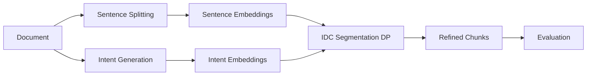

# IDC: Intent-Driven Dynamic Chunking

[](https://opensource.org/licenses/MIT)
[](https://www.python.org/downloads/)

**IDC** is a novel document segmentation method that chunks documents based on predicted user queries (intents) rather than arbitrary fixed sizes. By aligning chunk boundaries with actual information needs, IDC significantly improves retrieval performance across diverse document types.

> **Reproducibility Repository** -- This repository contains all code, datasets, configurations, and documentation needed to reproduce the results presented in the IDC paper.

**Paper**: [Intent-Driven Dynamic Chunking (PDF)](docs/idc_arxiv_ieee.pdf)

---

## Key Innovation

Traditional chunking methods segment documents using fixed-length windows, overlapping slides, or topic-boundary detection -- all of which ignore what users actually need to find. IDC takes a fundamentally different approach:

1. **Predict** what questions users will ask about a document (intents)
2. **Segment** so each chunk can answer one of those predicted questions
3. **Optimise** boundaries via dynamic programming balancing intent relevance, coherence, structure, and length


```mermaid
flowchart LR
    A[Document] --> B[Sentence Splitting]
    A --> C[Intent Generation]
    B --> D[Sentence Embeddings]
    C --> E[Intent Embeddings]
    D --> F[IDC Segmentation DP]
    E --> F
    F --> G[Refined Chunks]
    G --> H[Evaluation]
```

---

## Results

IDC outperforms all baselines across 4 diverse datasets:

| Dataset | Domain | Sentences | IDC R@1 | Best Baseline | Improvement |
|---------|--------|-----------|---------|---------------|-------------|
| **SQuAD** | Wikipedia | ~350 | **0.689** | Fixed (0.655) | **+5.2%** |
| **NewsQA** | News | 344 | **0.933** | Coherence (0.867) | **+7.6%** |
| **arXiv** | Academic | ~495 | **0.667** | Fixed (0.400) | **+67%** |
| **Fiori** | Technical | ~150 | **0.533** | Fixed (0.333) | **+60%** |

### SQuAD (293 gold spans, statistically significant p < 0.05)
```
IDC (auto-tuned): R@1=0.689, R@5=0.952, MRR=0.793, 58 chunks
Fixed-length:     R@1=0.655, R@5=0.951, MRR=0.752, 59 chunks
Sliding window:   R@1=0.604, Coherence: R@1=0.555, Paragraphs: R@1=0.635
```

### NewsQA Corpus (10 stories, 344 sentences, 15 gold spans)
```
IDC:        R@1=0.933, R@5=1.000, MRR=0.956, 25 chunks, 100% coverage
Coherence:  R@1=0.867, Fixed: R@1=0.667, Sliding: R@1=0.333
```

### arXiv (495 sentences, 15 gold spans, with auto-adaptive intents)
```
IDC (auto-adapted): R@1=0.667, R@5=0.933, MRR=0.789, 39 chunks
Fixed-length:       R@1=0.400, Coherence: R@1=0.400
```

### Fiori Technical Documentation (15 gold spans)
```
IDC:    R@1=0.533, R@5=0.933, MRR=0.686, 177 chunks
Fixed:  R@1=0.333, R@5=0.733, MRR=0.502
```

---

## Installation

### Prerequisites

- Python 3.10 or higher
- Google Gemini API key ([get one here](https://aistudio.google.com/app/apikey))

### Setup

```bash
# Clone the repository
git clone https://github.com/unseen1980/IDC.git
cd IDC

# Create virtual environment
python -m venv .venv
source .venv/bin/activate  # On Windows: .venv\Scripts\activate

# Install dependencies
pip install -r requirements.txt

# Configure API key
cp .env.example .env
# Edit .env and add your GEMINI_API_KEY
```

### Dependencies

| Package | Version | Purpose |
|---------|---------|---------|
| `google-generativeai` | >= 0.8.0 | Gemini API for intents and embeddings |
| `nltk` | >= 3.9 | Sentence tokenisation |
| `numpy` | >= 1.26.4 | Array operations |
| `faiss-cpu` | 1.8.0.post1 | Vector similarity search |
| `PySide6` | >= 6.7 | Qt desktop UI (optional) |
| `tiktoken` | >= 0.7.0 | Token counting |
| `tqdm` | >= 4.66.0 | Progress bars |
| `python-dotenv` | >= 1.0.1 | Environment management |

---

## Reproducing Paper Results

Each dataset evaluation can be reproduced with a single command. The exact hyperparameters used in the paper are stored in [`configs/paper_experiments.json`](configs/paper_experiments.json).

### SQuAD Evaluation

```bash
# Run with auto-tuning on 2 SQuAD articles (293 gold spans)
LIMIT=2 AUTO_TUNE=1 AUTO_TUNE_BASELINES=1 ./scripts/run_squad2_e2e.sh
```

### NewsQA Corpus Evaluation

```bash
# Run on concatenated NewsQA corpus (10 stories, 15 gold spans)
DOC_NAME=newsqa_corpus ./scripts/run_idc_pipeline.sh
```

### arXiv Long Document Evaluation

```bash
# Run on arXiv BERT/Finance paper with auto-adaptive intent generation
DOC_NAME=arxiv_bert_finance AUTO_ADAPT_INTENTS=1 ./scripts/run_idc_pipeline.sh
```

### Fiori Technical Documentation

```bash
# Run on SAP Fiori Tools documentation bundle
DOC_NAME=fiori_tools_docs ./scripts/run_idc_pipeline.sh
```

### QASPER Evaluation

```bash
# Run evaluation on 10 QASPER papers
./scripts/run_qasper_e2e.sh
```

### Single Document (Normans)

```bash
# Quick single-document run for verification
DOC_NAME=Normans ./scripts/run_idc_pipeline.sh
```

---

## Quick Start (Custom Documents)

### Option 1: End-to-End Pipeline

```bash
# Place your .txt file in data/input/
DOC_NAME=my_document ./scripts/run_idc_pipeline.sh
```

### Option 2: Interactive CLI

```bash
python src/cli.py menu
```

### Option 3: Step-by-Step

```bash
# 1. Preprocess document to sentences
python src/preprocess.py \
  --input data/input \
  --glob "my_document.txt" \
  --out out/my_document/sentences.jsonl

# 2. Generate intents (predicted questions)
python src/intents.py \
  --input data/input \
  --out out/my_document/predicted_intents.jsonl \
  --model gemini-2.5-flash

# 3. Embed sentences
python src/embed.py \
  --embedder gemini-embedding-001 --dim 1536 sentences \
  --sentences out/my_document/sentences.jsonl \
  --out-npy out/my_document/sentence_embs.npy \
  --out-meta out/my_document/sentences.meta.jsonl

# 4. Embed intents
python src/embed.py \
  --embedder gemini-embedding-001 --dim 1536 intents \
  --intents out/my_document/predicted_intents.jsonl \
  --out-npy out/my_document/intent_embs.npy \
  --out-flat out/my_document/intents.flat.jsonl

# 5. Run IDC segmentation
python src/idc_core.py \
  --algorithm dp \
  --sentences out/my_document/sentences.jsonl \
  --sentence-embs out/my_document/sentence_embs.npy \
  --sentences-meta out/my_document/sentences.meta.jsonl \
  --intents-flat out/my_document/intents.flat.jsonl \
  --intent-embs out/my_document/intent_embs.npy \
  --lambda 0.05 --max-len 12 --min-len 2 \
  --boundary-penalty 0.25 --coherence-weight 0.10 \
  --out out/my_document/segments.idc.jsonl
```

---

## Algorithm Details

### IDC Scoring Function

For a candidate chunk spanning sentences [j..i-1], IDC computes:

```
score(j->i) = dp[j]
            + intent_relevance(chunk)           # max cosine to any predicted intent
            + coherence_weight * coherence(chunk) # internal sentence similarity
            - length_penalty(length)             # encourage target chunk length
            - boundary_penalty                   # discourage over-segmentation
            - structural_cost(j)                 # respect paragraph/section boundaries
```

Dynamic programming finds the optimal sequence of chunk boundaries that maximises the total score over the entire document.

### Key Parameters

| Parameter | Default | Description |
|-----------|---------|-------------|
| `--lambda` | 0.05 | Length penalty weight (higher = shorter chunks) |
| `--max-len` | 12 | Maximum sentences per chunk |
| `--min-len` | 2 | Minimum sentences per chunk |
| `--boundary-penalty` | 0.25 | Per-boundary cost (higher = fewer chunks) |
| `--coherence-weight` | 0.10 | Internal coherence bonus weight |

### Auto-Tuning

IDC includes automatic hyperparameter optimisation using pseudo-spans:

```bash
AUTO_TUNE=1 ./scripts/run_idc_pipeline.sh
```

The auto-tuner searches over lambda, boundary penalty, max length, and coherence weight to maximise retrieval metrics on pseudo-labelled spans.

### Auto-Adaptive Intent Generation

For long documents (> 400 sentences), intent count is automatically scaled:

```bash
AUTO_ADAPT_INTENTS=1 DOC_NAME=arxiv_bert_finance ./scripts/run_idc_pipeline.sh
```

---

## Desktop UI (Qt)

A PySide6 desktop application for interactive benchmarking:

```bash
python ui/qt_app/main.py
```

Features:
- Select from all paper datasets (SQuAD, NewsQA, arXiv, Fiori, QASPER)
- Configure IDC hyperparameters with paper defaults
- Run evaluations and visualise results (R@1, R@5, MRR, Coverage charts)
- Load and compare results across runs
- Export results to CSV

See [`ui/qt_app/README.md`](ui/qt_app/README.md) for details.

---

## Project Structure

```
IDC/
├── src/                        # Core implementation
│   ├── idc_core.py             # IDC algorithm (DP segmentation + refinement)
│   ├── intents.py              # Intent generation via Gemini LLM
│   ├── intents_chunked.py      # Chunked intent generation for long documents
│   ├── embed.py                # Sentence and intent embeddings
│   ├── preprocess.py           # Document to sentence splitting
│   ├── baselines.py            # Baseline methods (fixed, sliding, coherence, paragraphs)
│   ├── auto_tune.py            # IDC hyperparameter auto-tuning
│   ├── auto_tune_baselines.py  # Baseline auto-tuning
│   ├── eval_retrieval.py       # Retrieval evaluation (R@1, R@5, MRR)
│   ├── eval_coverage.py        # Coverage evaluation
│   ├── build_chunks.py         # Chunk construction and embedding
│   ├── make_pseudo_spans.py    # Pseudo-span generation for auto-tuning
│   ├── cli.py                  # Interactive CLI
│   ├── config.py               # Configuration management
│   ├── stats_summary.py        # Results aggregation
│   ├── convert_squad.py        # SQuAD format converter
│   ├── convert_qasper.py       # QASPER format converter
│   ├── convert_newsqa.py       # NewsQA format converter
│   ├── convert_newsqa_corpus.py # NewsQA corpus builder
│   ├── merge_corpus.py         # Multi-document corpus merger
│   ├── adaptive_params.py      # Document-adaptive parameter selection
│   └── utils.py                # Shared utilities
├── scripts/                    # Pipeline scripts
│   ├── run_idc_pipeline.sh     # Main end-to-end pipeline
│   ├── run_squad2_e2e.sh       # SQuAD evaluation pipeline
│   ├── run_qasper_e2e.sh       # QASPER evaluation pipeline
│   ├── run_newsqa_e2e.sh       # NewsQA evaluation pipeline
│   ├── download_qasper.sh      # QASPER dataset downloader
│   ├── eval_all_methods.py     # Evaluate all methods on a dataset
│   ├── find_best_idc_config.py # Configuration search utility
│   └── generate_stats_json.py  # Statistics generator
├── configs/                    # Experiment configurations
│   └── paper_experiments.json  # Exact parameters for all paper results
├── data/                       # Datasets (included for reproducibility)
│   ├── squad/                  # SQuAD 2.0 dev set (4.4 MB)
│   ├── qasper/                 # QASPER dev set
│   ├── arxiv_long/             # arXiv long papers (3 documents)
│   ├── fiori/                  # SAP Fiori technical documentation
│   ├── newsqa/                 # NewsQA configuration
│   ├── news-qa-summarization/  # NewsQA corpus data
│   └── input/                  # Pre-extracted document texts (23 files)
├── ui/                         # Desktop application
│   └── qt_app/                 # PySide6 benchmark UI
├── docs/                       # Documentation
├── IntentDrivenDynamicChunking.pdf  # Full paper
├── requirements.txt            # Python dependencies
├── .env.example                # API key template
└── LICENSE                     # MIT License
```

---

## Datasets

| Dataset | Size | Domain | Documents | Gold Spans | Location |
|---------|------|--------|-----------|------------|----------|
| SQuAD 2.0 | 4.4 MB | Wikipedia | 2 articles | 293 | `data/squad/` |
| NewsQA | ~50 KB | News corpus | 10 stories | 15 | `data/news-qa-summarization/` |
| arXiv | ~140 KB | Research papers | 3 papers | 15 | `data/arxiv_long/` |
| Fiori | ~170 KB | Technical docs | 1 bundle | 15 | `data/fiori/` |
| QASPER | ~13 MB | Academic papers | 10 papers | 10 | `data/qasper/` |

All datasets are included in this repository for full reproducibility. The `data/input/` directory contains pre-extracted text files used by the pipeline scripts.

---

## Evaluation Metrics

| Metric | Description |
|--------|-------------|
| **R@1** | Is the correct answer in the top-1 retrieved chunk? |
| **R@5** | Is the correct answer in the top-5 retrieved chunks? |
| **MRR** | Mean Reciprocal Rank of correct answers |
| **Coverage** | Percentage of answer spans fully contained in a single chunk |

---

## Documentation

- [IDC Algorithm](docs/IDC_ALGORITHM.md) -- Mathematical formulation and baseline comparisons
- [Thesis-Ready Results](docs/THESIS_READY_RESULTS.md) -- Publication-quality results tables
- [Dataset Selection Rationale](docs/DATASET_SELECTION_RATIONALE.md) -- Why these datasets were chosen
- [Implementation Details](docs/IMPLEMENTATION_DETAILS.md) -- Code architecture and design decisions
- [Auto-Adaptive Intents](docs/AUTO_ADAPTIVE_INTENTS.md) -- Scaling intent generation for long documents
- [Experimental Configuration](docs/EXPERIMENTAL_CONFIGURATION.md) -- Full experimental setup
- [Paper Experiments Config](configs/paper_experiments.json) -- Exact parameters for all results

---

## Troubleshooting

**"GEMINI_API_KEY is not set"**
```bash
cp .env.example .env
# Edit .env and add your API key
```

**"Sentence embeddings do not match sentences.jsonl length"**
```bash
# Re-run preprocessing before embedding
python src/preprocess.py --input data/input --out out/sentences.jsonl
```

**Rate limiting from Gemini API**
- The pipeline includes automatic rate limiting and retries
- For large datasets, consider running in batches

**Large documents produce few intents**
- Enable auto-adaptive intent generation: `AUTO_ADAPT_INTENTS=1`
- This scales intent count proportionally to document length

---

## Citation

If you use this code in your research, please cite:

```bibtex
@mastersthesis{idc2025,
  author       = {Christos Koutsiaris},
  title        = {Intent-Driven Dynamic Chunking: Aligning Document Segmentation
                  with User Information Needs for Improved Retrieval},
  school       = {University of Limerick},
  year         = {2025},
  type         = {MSc Thesis},
  note         = {Available at: \url{https://github.com/unseen1980/IDC}}
}
```

---

## License

This project is licensed under the MIT License. See [LICENSE](LICENSE) for details.

## Acknowledgements

- Google Generative AI for the Gemini API
- The creators of SQuAD, QASPER, and NewsQA datasets
- University of Limerick
