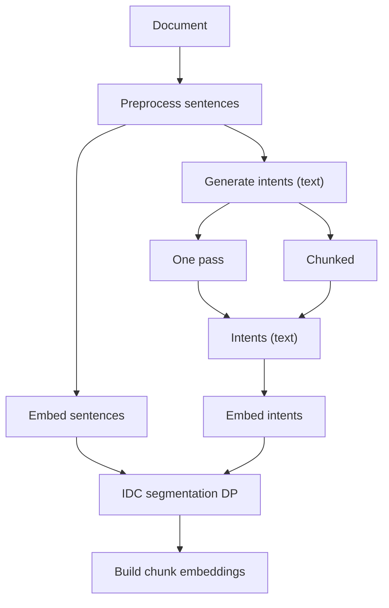
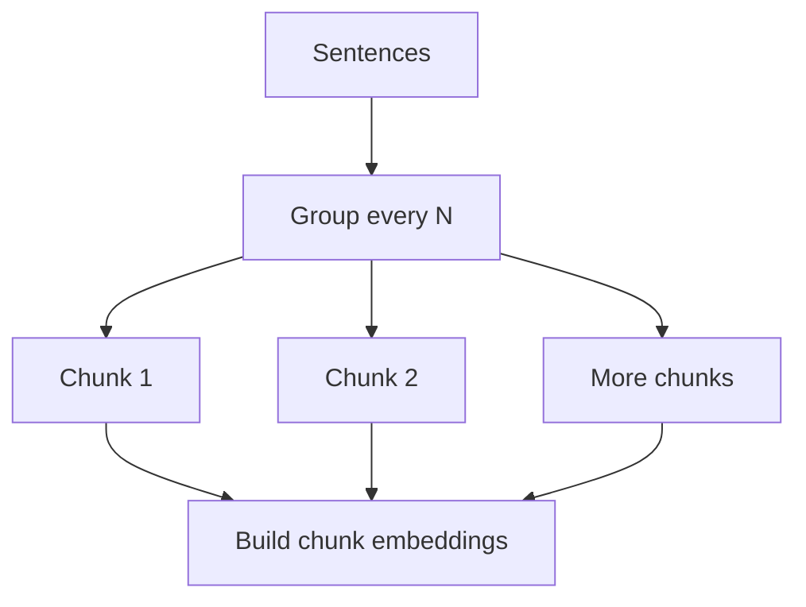
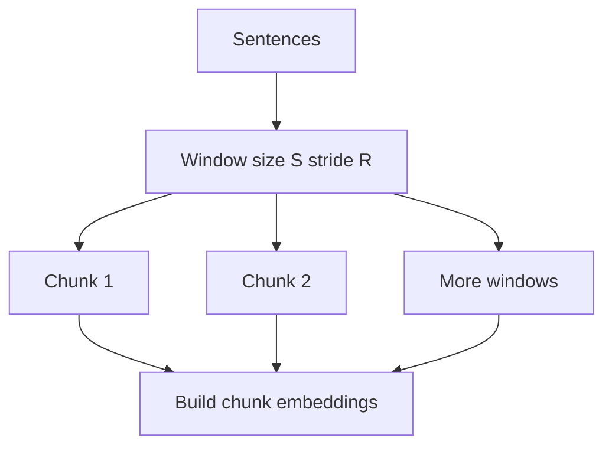
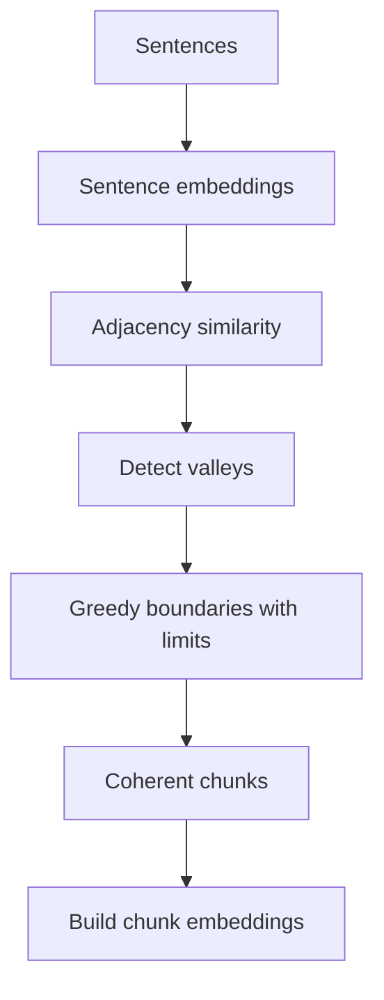
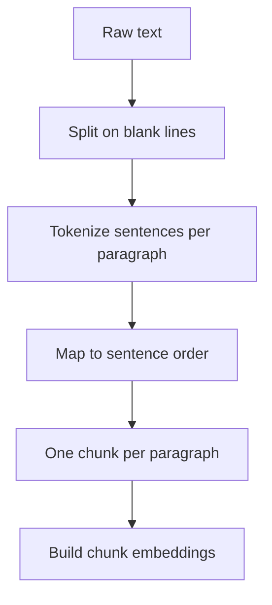
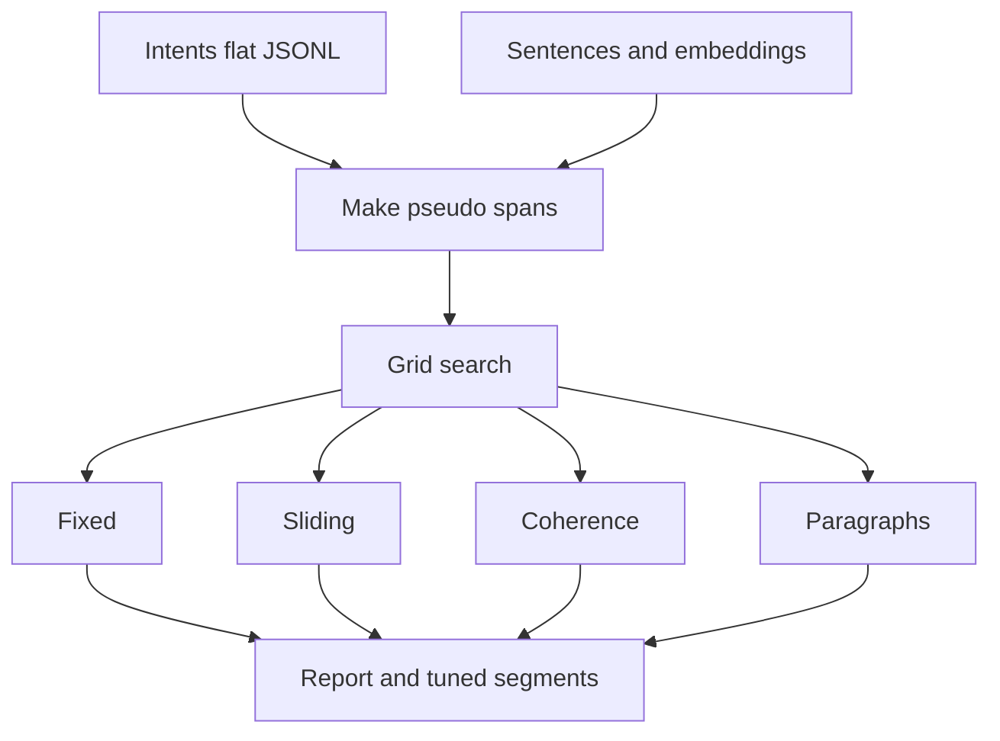

# Intent-Driven Dynamic Chunking (IDC): Overview and Baselines

This document explains how IDC works end-to-end, how the baselines operate, and shows small, visual examples side-by-side. Diagrams use Mermaid (rendered on GitHub and many IDEs).

## TL;DR
- IDC predicts user intents (questions) and segments text so each chunk aligns with likely information needs.
- Objective = intent alignment + completeness + coherence + structural priors − length/boundary penalties.
- Dynamic Programming finds the best set of boundaries under constraints (min/max chunk length).
- Baselines (fixed, sliding, coherence, paragraphs) ignore or only partially consider user intent.

---

## IDC Pipeline (End-to-End)



Key steps
- Generate intents: 15–60 diverse questions (one‑pass or chunked windows with diversity selection).
- Embed: sentence and intent vectors (optionally Query‑Aware sentence embeddings).
- Segment (DP): pick boundaries maximizing intent alignment and quality terms.
- Auto‑tune (optional): use pseudo spans to choose λ/boundary/max_len/coherence‑weight.
- Build chunk embeddings: mean of sentence vectors or intent‑weighted mean.

---

## IDC Objective (Intuition)

For any candidate chunk [l..r]:

- Intent alignment: combine best match and top‑k average to avoid narrow focus.
- Completeness: bonus for mid‑sized chunks (e.g., 3–6 sentences); penalty for overly long/short.
- Coherence bonus: reward semantically cohesive chunks.
- Paragraph/structural priors: favor aligning to natural boundaries and discourse markers.
- Penalties: length penalty proportional to λ, boundary penalty for each cut, structural cost where priors discourage boundaries.

DP finds the optimal path (sequence of boundaries) under min_len/max_len constraints.

---

## Baselines (How They Work)

This section details each baseline with a flow chart, parameters, and short pseudocode that matches `src/baselines.py`.

### Fixed‑length (Uniform Segments)




- Parameters: `--target-len N` (default 6)
- CLI mapping: `python src/baselines.py fixed --target-len 6`

Pseudocode
```
i = 0
while i < num_sentences:
  j = min(i + N, num_sentences)
  make_chunk(i..j-1)
  i = j
```

Pros/Cons
- Pros: Fast, predictable sizes, simple to cache/index.
- Cons: Can split answers mid‑thought; ignores content and user intent.

Mini example (N=3)
- [1–3], [4–6], [7–9]

---

### Sliding Window (Overlap Segments)



- Parameters: `--size S`, `--stride R` (defaults: 6 and 3)
- CLI mapping: `python src/baselines.py sliding --size 6 --stride 3`

Pseudocode
```
i = 0
while i < num_sentences:
  j = min(i + S, num_sentences)
  make_chunk(i..j-1)
  if j == num_sentences: break
  i += R
```

Pros/Cons
- Pros: Overlap boosts recall when answers straddle boundaries.
- Cons: Many near‑duplicates; larger index; no intent awareness.

Mini example (size=4, stride=2)
- [1–4], [3–6], [5–8], [7–9]

---

### Coherence‑Based (TextTiling‑like)



- Parameters: `--win W`, `--min-len m`, `--max-len M`, `--approx-chunk-len A`
- CLI mapping: `python src/baselines.py coherence --win 1 --min-len 1 --max-len 10 --approx-chunk-len 6`

Pseudocode
```
for boundary i between sentences:
  left = mean(emb[i-W+1..i])
  right = mean(emb[i+1..i+W])
  score[i] = cosine(left, right)
valleys = rank ascending(score)
insert boundaries at lowest valleys
respect min_len/max_len constraints
```

Pros/Cons
- Pros: Respects topic shifts; robust across chunk sizes.
- Cons: No user intent; may pack multiple Q&A targets in one chunk.

Mini example (W=1, m=1, M=10)
- [1–3] Setup, [4–6] Scaffolding/config, [7–9] Run/troubleshoot/CI

---

### Paragraphs (Structural)



- Parameters: none (optional `--input-dir` + `--glob` for raw text)
- CLI mapping: `python src/baselines.py paragraphs`

Pseudocode
```
paras = split_on_blank_lines(raw_text)
for p in paras:
  n = count_sentences(p)
  make_chunk(cursor .. cursor + n - 1)
  cursor += n
if cursor < num_sentences:
  make_chunk(cursor .. end)
```

Pros/Cons
- Pros: Preserves author formatting; often aligns with documentation sections.
- Cons: Paragraph ≠ answer unit; no intent guidance; uneven chunk sizes.

Mini example
- Paragraph blocks → [1–3], [4–6], [7–9]

---

### Baseline Auto‑Tuning (Optional)



- Trigger: `AUTO_TUNE_BASELINES=1` (default OFF in UI)
- Tunes baseline hyperparameters against pseudo‑spans for better fairness.

---

---

## Mini Example (Visual)

Document (9 sentences; short paraphrase of a “Fiori Tools” style page):
1. Install the Fiori Tools extensions from the Marketplace.
2. Ensure Node.js 18+ is installed.
3. Open VS Code and sign in to SAP BTP.
4. Run the application generator to scaffold a project.
5. Choose Fiori Elements template and OData service URL.
6. Configure ESLint and prettier in the wizard.
7. To preview, run `npm start` and open the local URL.
8. If port 8080 is busy, set a different port in ui5.yaml.
9. For CI, run `npm run lint` and `npm test`.

How each method might segment:

Fixed (N=3)
- [1–3] Install/Node/Sign‑in
- [4–6] Generator/Template/ESLint
- [7–9] Preview/Port/CI

Sliding (size=4, stride=2)
- [1–4], [3–6], [5–8], [7–9]

Coherence
- [1–3] Setup
- [4–6] Scaffolding/config
- [7–9] Run/troubleshoot/CI

Paragraphs (if blank lines separated sections)
- Likely identical to the three topical blocks above.

IDC (example intents)
- Q1: “How do I install Fiori Tools?” → [1–3]
- Q2: “How do I generate a Fiori app?” → [4–6]
- Q3: “How do I preview and fix port conflicts?” → [7–8]
- Q4: “How do I run lint/tests in CI?” → [9] (may merge with [7–8] if min_len requires)

The key difference: IDC shapes chunks around answerable questions. Baselines shape around length/structure.

---

## Worked Examples From Fiori Tools Docs (Deployment and MTA)

Below is a real excerpt adapted from `data/fiori/fiori_tools_docs.txt` about deployment configuration and MTA files, and how each method transforms it into chunks.

Excerpt
```
Adding Deployment Configuration to an Existing MTA Deployment File
When the user selects a project folder path for an application and an MTA file already exists in the selected folder, the SAP Fiori application generator automatically switches to Yes for adding deployment configuration. During the generation of an application, the generator updates the MTA project file by default with the supplied deployment configuration.

For successful deployment of the generated application, the MTA file must already have the required services defined, depending on whether the application has to be deployed by using the managed, Application Frontend service, or standalone application router. To ensure the required services are added to the MTA deployment file, use the MTA generator provided by SAP Fiori tools or the Application Router generator in SAP Business Application Studio. For more information, see Generating an MTA Deployment File.

For local CAP projects, you can optionally choose to generate an instance based destination as part of CF deployment configuration, or use an existing instance based destination that is already defined in your MTA deployment file.

Creating an MTA Deployment File during Application Generation
If the MTA deployment file is not available in the project folder location, you can create a new file. To do so, when adding deployment configuration, select Cloud Foundry as the target landscape. In this case, the relevant MTA file to be used with a managed application router will be added to the same folder as your generated SAP Fiori application.

In this scenario, the generated MTA file is not applicable for use with multiple applications, as it is contained in the same folder as the SAP Fiori application. We recommend that you first create the MTA file and then generate the SAP Fiori application in a subfolder.
```

See “Detailed Splits (Exact Sentences Per Chunk)” below for method-by-method chunks with exact sentence IDs and text.

IDC summary is also included in the detailed splits section with exact sentences per intent-aligned chunk.

Observations
- Fixed/Sliding may group unrelated sub-steps and mix “requirements” with “how-to”, or duplicate content via overlap.
- Coherence/Paragraphs align well to headings, but may still place two distinct questions (e.g., services vs generators) in one chunk.
- IDC produces one chunk per user question, improving retrieval granularity: “existing MTA behavior”, “required services & tools”, “CAP destination”, “create MTA during generation”, “reuse limitation and recommended structure”.

---

### Detailed Splits (Exact Sentences Per Chunk)

To make the transformation explicit, we first index the excerpt by sentences S1..S11.

Sentence labeling
```
Title1: Adding Deployment Configuration to an Existing MTA Deployment File
S1: When the user selects a project folder path for an application and an MTA file already exists in the selected folder, the SAP Fiori application generator automatically switches to Yes for adding deployment configuration.
S2: During the generation of an application, the generator updates the MTA project file by default with the supplied deployment configuration.

S3: For successful deployment of the generated application, the MTA file must already have the required services defined, depending on whether the application has to be deployed by using the managed, Application Frontend service, or standalone application router.
S4: To ensure the required services are added to the MTA deployment file, use the MTA generator provided by SAP Fiori tools or the Application Router generator in SAP Business Application Studio.
S5: For more information, see Generating an MTA Deployment File.

S6: For local CAP projects, you can optionally choose to generate an instance based destination as part of CF deployment configuration, or use an existing instance based destination that is already defined in your MTA deployment file.

Title2: Creating an MTA Deployment File during Application Generation
S7: If the MTA deployment file is not available in the project folder location, you can create a new file.
S8: To do so, when adding deployment configuration, select Cloud Foundry as the target landscape.
S9: In this case, the relevant MTA file to be used with a managed application router will be added to the same folder as your generated SAP Fiori application.

S10: In this scenario, the generated MTA file is not applicable for use with multiple applications, as it is contained in the same folder as the SAP Fiori application.
S11: We recommend that you first create the MTA file and then generate the SAP Fiori application in a subfolder.
```

Fixed-length (N=3)
```
Chunk F1 [S1–S3]
  S1, S2, S3
Chunk F2 [S4–S6]
  S4, S5, S6
Chunk F3 [S7–S9]
  S7, S8, S9
Chunk F4 [S10–S11]
  S10, S11
```

Exact text per chunk
```
F1
  S1: When the user selects a project folder path for an application and an MTA file already exists in the selected folder, the SAP Fiori application generator automatically switches to Yes for adding deployment configuration.
  S2: During the generation of an application, the generator updates the MTA project file by default with the supplied deployment configuration.
  S3: For successful deployment of the generated application, the MTA file must already have the required services defined, depending on whether the application has to be deployed by using the managed, Application Frontend service, or standalone application router.

F2
  S4: To ensure the required services are added to the MTA deployment file, use the MTA generator provided by SAP Fiori tools or the Application Router generator in SAP Business Application Studio.
  S5: For more information, see Generating an MTA Deployment File.
  S6: For local CAP projects, you can optionally choose to generate an instance based destination as part of CF deployment configuration, or use an existing instance based destination that is already defined in your MTA deployment file.

F3
  S7: If the MTA deployment file is not available in the project folder location, you can create a new file.
  S8: To do so, when adding deployment configuration, select Cloud Foundry as the target landscape.
  S9: In this case, the relevant MTA file to be used with a managed application router will be added to the same folder as your generated SAP Fiori application.

F4
  S10: In this scenario, the generated MTA file is not applicable for use with multiple applications, as it is contained in the same folder as the SAP Fiori application.
  S11: We recommend that you first create the MTA file and then generate the SAP Fiori application in a subfolder.
```

Sliding window (size=4, stride=2)
```
Win S1–S4:  S1, S2, S3, S4
Win S3–S6:  S3, S4, S5, S6
Win S5–S8:  S5, S6, S7, S8
Win S7–S10: S7, S8, S9, S10
Win S9–S11: S9, S10, S11
```

Exact text for first two windows
```
Win S1–S4
  S1: When the user selects a project folder path for an application and an MTA file already exists in the selected folder, the SAP Fiori application generator automatically switches to Yes for adding deployment configuration.
  S2: During the generation of an application, the generator updates the MTA project file by default with the supplied deployment configuration.
  S3: For successful deployment of the generated application, the MTA file must already have the required services defined, depending on whether the application has to be deployed by using the managed, Application Frontend service, or standalone application router.
  S4: To ensure the required services are added to the MTA deployment file, use the MTA generator provided by SAP Fiori tools or the Application Router generator in SAP Business Application Studio.

Win S3–S6
  S3: For successful deployment of the generated application, the MTA file must already have the required services defined, depending on whether the application has to be deployed by using the managed, Application Frontend service, or standalone application router.
  S4: To ensure the required services are added to the MTA deployment file, use the MTA generator provided by SAP Fiori tools or the Application Router generator in SAP Business Application Studio.
  S5: For more information, see Generating an MTA Deployment File.
  S6: For local CAP projects, you can optionally choose to generate an instance based destination as part of CF deployment configuration, or use an existing instance based destination that is already defined in your MTA deployment file.
```

Coherence (topic boundaries inferred)
```
C1 [S1–S2]
  S1: When the user selects a project folder path for an application and an MTA file already exists in the selected folder, the SAP Fiori application generator automatically switches to Yes for adding deployment configuration.
  S2: During the generation of an application, the generator updates the MTA project file by default with the supplied deployment configuration.

C2 [S3–S5]
  S3: For successful deployment of the generated application, the MTA file must already have the required services defined, depending on whether the application has to be deployed by using the managed, Application Frontend service, or standalone application router.
  S4: To ensure the required services are added to the MTA deployment file, use the MTA generator provided by SAP Fiori tools or the Application Router generator in SAP Business Application Studio.
  S5: For more information, see Generating an MTA Deployment File.

C3 [S6]
  S6: For local CAP projects, you can optionally choose to generate an instance based destination as part of CF deployment configuration, or use an existing instance based destination that is already defined in your MTA deployment file.

C4 [S7–S9]
  S7: If the MTA deployment file is not available in the project folder location, you can create a new file.
  S8: To do so, when adding deployment configuration, select Cloud Foundry as the target landscape.
  S9: In this case, the relevant MTA file to be used with a managed application router will be added to the same folder as your generated SAP Fiori application.

C5 [S10–S11]
  S10: In this scenario, the generated MTA file is not applicable for use with multiple applications, as it is contained in the same folder as the SAP Fiori application.
  S11: We recommend that you first create the MTA file and then generate the SAP Fiori application in a subfolder.
```

Paragraphs (split at headings / blank lines)
```
P1 [S1–S2]
  S1: When the user selects a project folder path for an application and an MTA file already exists in the selected folder, the SAP Fiori application generator automatically switches to Yes for adding deployment configuration.
  S2: During the generation of an application, the generator updates the MTA project file by default with the supplied deployment configuration.

P2 [S3–S5]
  S3: For successful deployment of the generated application, the MTA file must already have the required services defined, depending on whether the application has to be deployed by using the managed, Application Frontend service, or standalone application router.
  S4: To ensure the required services are added to the MTA deployment file, use the MTA generator provided by SAP Fiori tools or the Application Router generator in SAP Business Application Studio.
  S5: For more information, see Generating an MTA Deployment File.

P3 [S6]
  S6: For local CAP projects, you can optionally choose to generate an instance based destination as part of CF deployment configuration, or use an existing instance based destination that is already defined in your MTA deployment file.

P4 [S7–S9]
  S7: If the MTA deployment file is not available in the project folder location, you can create a new file.
  S8: To do so, when adding deployment configuration, select Cloud Foundry as the target landscape.
  S9: In this case, the relevant MTA file to be used with a managed application router will be added to the same folder as your generated SAP Fiori application.

P5 [S10–S11]
  S10: In this scenario, the generated MTA file is not applicable for use with multiple applications, as it is contained in the same folder as the SAP Fiori application.
  S11: We recommend that you first create the MTA file and then generate the SAP Fiori application in a subfolder.
```

IDC (intent-aligned; one chunk per question)
```
Q1: What happens if an MTA file already exists when generating?
    Chunk I1 [S1–S2]
Q2: Which services must the MTA contain and how do I add them?
    Chunk I2 [S3–S4]  (S5 is a pure reference link and may be dropped)
Q3: For local CAP, how do I set or reuse the destination?
    Chunk I3 [S6]
Q4: How do I create an MTA file during app generation?
    Chunk I4 [S7–S9]
Q5: Can the generated MTA be reused across multiple apps? What structure to use?
    Chunk I5 [S10–S11]
```

Exact text per IDC chunk
```
I1
  S1: When the user selects a project folder path for an application and an MTA file already exists in the selected folder, the SAP Fiori application generator automatically switches to Yes for adding deployment configuration.
  S2: During the generation of an application, the generator updates the MTA project file by default with the supplied deployment configuration.

I2
  S3: For successful deployment of the generated application, the MTA file must already have the required services defined, depending on whether the application has to be deployed by using the managed, Application Frontend service, or standalone application router.
  S4: To ensure the required services are added to the MTA deployment file, use the MTA generator provided by SAP Fiori tools or the Application Router generator in SAP Business Application Studio.

I3
  S6: For local CAP projects, you can optionally choose to generate an instance based destination as part of CF deployment configuration, or use an existing instance based destination that is already defined in your MTA deployment file.

I4
  S7: If the MTA deployment file is not available in the project folder location, you can create a new file.
  S8: To do so, when adding deployment configuration, select Cloud Foundry as the target landscape.
  S9: In this case, the relevant MTA file to be used with a managed application router will be added to the same folder as your generated SAP Fiori application.

I5
  S10: In this scenario, the generated MTA file is not applicable for use with multiple applications, as it is contained in the same folder as the SAP Fiori application.
  S11: We recommend that you first create the MTA file and then generate the SAP Fiori application in a subfolder.
```

Notes
- Exact sentence IDs make it easy to compare how each method groups text.
- Fixed and Sliding ignore semantics (and user needs), while Coherence/Paragraphs respect structure; IDC aligns chunks to answerable questions.


## What To Expect in Outputs

- IDC chunks include an assigned “intent” label (best‑matching predicted query) and similarity score.
- Baseline chunks have no intent label and are derived solely from sentence order/embeddings/paragraphs.
- stats.json (UI) includes per‑variant metrics:
  - Span‑mode R@1/R@5/MRR, Answer coverage, Avg sentences per chunk.

---

## Recommended Settings for Long Technical Docs (e.g., Fiori Tools)

- Intents Mode: Force Chunked
- Chunk size: 9,000 chars; Questions per chunk: 6; Generation multiplier: 3.0
- Max intents (final): 50; Diversity selection: ON (MMR/Clustering)
- Query‑Aware Embeddings: ON (helps retrieval)
- Adaptive Parameters & Structural Priors: ON
- Auto‑tune IDC: ON (uses pseudo spans)

---

## How Baselines Remain Comparable

- Baselines never use intent labels; they run from the same sentences (and, if query‑aware is enabled, from the same sentence embeddings).
- You can disable Query‑Aware Embeddings to keep baseline embeddings strictly neutral.

---

## Files and Entry Points (Code Map)

- Intents: `src/intents.py`, `src/intents_chunked.py`
- Embeddings: `src/embed.py`
- IDC Segmentation (DP + objective): `src/idc_core.py`
- Baselines: `src/baselines.py`
- Build chunk embeddings: `src/build_chunks.py`
- Auto‑tuning (IDC): `src/auto_tune.py`
- Pseudo‑spans: `src/make_pseudo_spans.py`
- Pipeline (single doc): `scripts/run_idc_pipeline.sh`
- UI: `ui/qt_app/main.py` (now exposes “Intents Options” section)

---

## Appendix: IDC DP Scoring (Informal)

For chunk [l..r]:
- `intent_score = 0.7 * max(sims) + 0.3 * mean(top3(sims))`
- `completeness_bonus ≈ +0.1` for 3–6 sentences; mild penalties otherwise
- `coherence_bonus ≈ +0.05 * coherence(l..r)`
- `boundary_bonus ≈ +0.10/+0.15` if start/end align with paragraph boundaries
- `length_penalty ≈ adaptive_lambda * f(len)`; `boundary_penalty` per boundary
- `structural_cost` from priors (discourages cuts in awkward spots)

DP maximizes cumulative score while honoring `min_len ≤ chunk_len ≤ max_len`.
